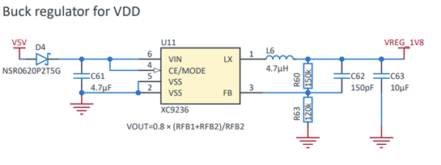
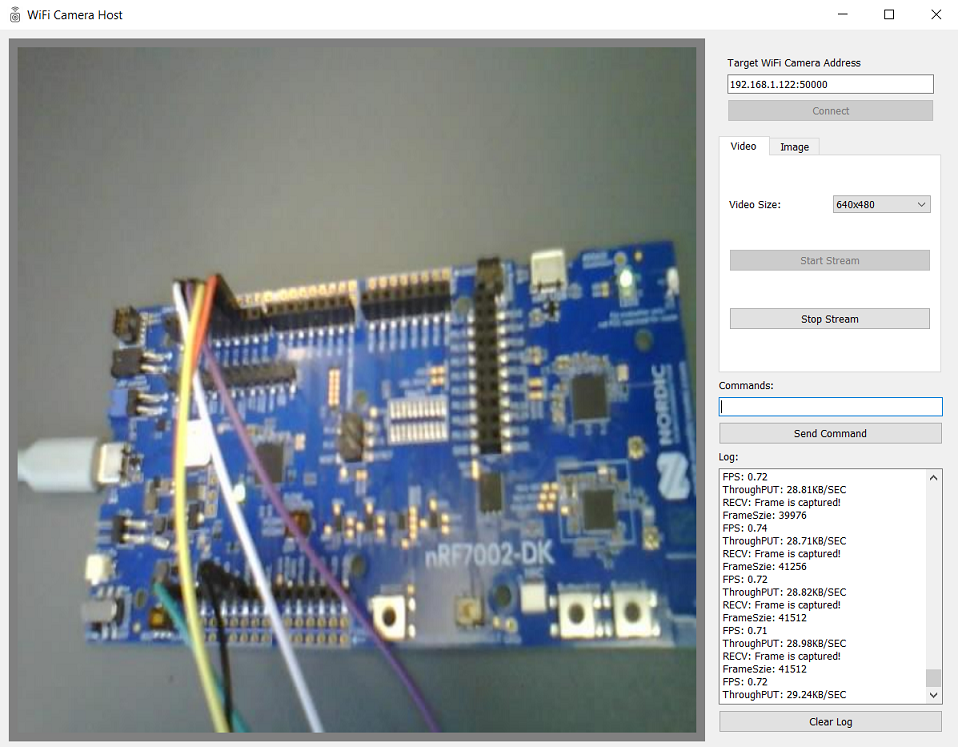

# nRF70_WiFi_Camera_Demo
WiFi Camera demo based on nRF7002DK and Arducam Mega Camera.

# Hardware Setup

---

## Arducam Mega Camera

* [Product Page](https://docs.arducam.com/Arduino-SPI-camera/MEGA-SPI/MEGA-SPI-Camera/)
* [Datasheet](https://www.arducam.com/downloads/datasheet/Arducam_MEGA_SPI_Camera_Application_Note.pdf)
* [Communication Protocol](https://www.arducam.com/docs/arducam-mega/arducam-mega-getting-started/packs/HostCommunicationProtocol.html)

## nRF7002DK 

* [Product Page](https://www.nordicsemi.com/Products/Development-hardware/nRF7002-DK) (Including schematic and PCB files in Downloads tab)
* [User Guide](https://infocenter.nordicsemi.com/topic/ug_nrf7002_dk/UG/nrf7002_DK/intro.html)
* [nRF7002 Specification](https://infocenter.nordicsemi.com/topic/ps_nrf7002/keyfeatures_html5.html)

## Hardware Connection

On nRF7002DK, the nRF5340 host MCU use 1.8v as VDD supply voltage for IO pins to interface with WiFi companion IC nRF7002. Arducam Mega Camera IO voltage only support 3.3v/5v.
Considering the max acceptable VDD supply voltage for nRF7002 is 3.6v according to nRF7002 specification(Table 11: Recommended operating conditions). We need to change nRF5340 IO VDD supply voltage from 1.8v to 3.3v. 

Accroding to following regulator design in nRF7002DK schematic, modifying R60 to 375K or R63 to 48K will change IO VDD to 3.3v.



Here is the pin connection with Arducam Mega SPI Camera marked on nRF7002DK.


# Firmware Prepare

---

## How firmware works

Two sockets are used by the UDP Server(WiFiCam+nRF7002DK).

UDP Client(WiFiCamHost+PC):50000 <->> UDP Server(WiFiCam+nRF7002DK):60000 = socket_recv

UDP Client(WiFiCamHost+PC):50005 <<-> UDP Server(WiFiCam+nRF7002DK):60006 = socket_send

socket_recv is built by the UDP server to wait for the UDP client to connect to its address, then the server can know the client address. The server builds a new socket_send to send WiFiCam data like camera info, and video frame to the client. The previous socket_recv is used to receive commands from the UDP client. 

## Install nRF Connect SDK(NCS) version 2.5.1

Please refer to https://developer.nordicsemi.com/nRF_Connect_SDK/doc/2.5.1/nrf/installation.html

## Cherry pick ArduCAM Mega Zephyr driver

```
cd c:/NCS/v2.5.1/zephyr
git remote add arducam https://github.com/ArduCAM/zephyr.git 
git fetch arducam
From https://github.com/ArduCAM/zephyr
 * [new branch]              add_arducam_mega_beta    -> arducam/add_arducam_mega_beta
 * [new branch]              add_arducam_mega_driver  -> arducam/add_arducam_mega_driver
 * [new branch]              add_full_featured_sample -> arducam/add_full_featured_sample
 * [new branch]              main                     -> arducam/main
 * [new branch]              update_video_controls    -> arducam/update_video_controls
git log arducam/add_arducam_mega_driver
git cherry-pick ce6334
git cherry-pick 8cb926
git cherry-pick 2db7d6
git cherry-pick 37d1b7
git remote remove arducam
```
## Download this repository

```
git clone https://github.com/charlieshao5189/nRF70_WiFi_Camera_Demo.git
```

## Firmware Building

There are two options for enabling WiFi connection. If the WiFi AP(Access Point) is not fixed, you can build firmware with option 1). If you have a fixed AP, building firmware with option 2) will make your life much easier because you can avoid manual WiFi connection setup.

1) Firmware that enables WiFi using terminal commands. 

Build the firmwre with defalut configuration using nRF Connect SDK VS Code externsion or following command.

```
west build -b nRF7002dk_nrf5340_cpuapp
```

Open an uart terminal which connected with nRF7002DK VCOM1. Try the following commands to connect with target WiFi AP. You can learn from DevAcademy [WiFi Fundamentals course Exercise 1](https://academy.nordicsemi.com/courses/wi-fi-fundamentals/lessons/lesson-3-wifi-fundamentals/topic/lesson-3-exercise-1-2/) to get more details about "wifi_cred" commands.

```
uart:~$ wifi_cred help
wifi_cred - Wi-Fi Credentials commands
Subcommands:
  add           :Add network to storage.
  auto_connect  :Connect to any stored network.
  delete        :Delete network from storage.
  list          :List stored networks.
uart:~$ wifi_cred add help
Usage: wifi_cred add "network name" {OPEN, WPA2-PSK, WPA2-PSK-SHA256, WPA3-SAE} [psk/password] [bssid] [{2.4GHz, 5GHz}] [favorite]
uart:~$ wifi_cred add "your-ssid" WPA2-PSK "your-password"
uart:~$ wifi_cred auto_connect

```
If nRF7002DK connect with a AP succesfully, the WiFi credentionals will be stored. nRF7002DK will try to reconnect automatically using stored credentionals after device reset. A prebuild firware is avaliable in prebuiltFW folder.

2) Firmware that enables WiFi with static crendtials.

```
west build -b nRF7002dk_nrf5340_cpuapp -- -DEXTRA_CONF_FILE=overlay-wifi-crendtials-static.conf
```

Fill your WiFi AP SSID and Password, add overlay-wifi-crendtials-static.conf to build the firmware.


```
# Enable static Wi-Fi network configuration
CONFIG_WIFI_CREDENTIALS_STATIC=y
CONFIG_WIFI_CREDENTIALS_STATIC_SSID="your-ssid"
CONFIG_WIFI_CREDENTIALS_STATIC_PASSWORD="your-password"
# Disable support for shell commands
CONFIG_SHELL=n
```

# WiFi Camera Host GUI Application(WiFiCamHost) 

---

The WiFICamHost is a python script that can run on any PC to communicate WiFi Camera Device(nRF7002DK+ArducamMegaCamera here) through UDP protocol.
Ensure you have installed a recent Python version then run the following command to start the application on your PC terminal.

```
cd WiFICamHost
pip install -r requirements.txt
python WiFi_Cam_Host.py
```

# Testing

---

1) Get the WiFi Camera address from its log after the WiFi connection is built.
```
 <inf> NetUtil: WiFi Camera Server is ready on nRF7002DK, copy and paste 192.168.1.101:60000 in Target WiFi Camera Address window on WiFi Camera Host.
```
2) Run the WiFiCamHost script and connect to the target address from a PC in the same local network.
3) In the Video table, choose a resolution and press start stream, then the video stream will start.



## Future Improvments

1) Modify overlay-tx-prioritized.conf can potentionafially improve WiFi speed.
2) FPS and ThrougPut calculation in WiFi_Cam_Host.py is not accurate.
3) [zperf](https://academy.nordicsemi.com/courses/wi-fi-fundamentals/lessons/lesson-3-wifi-fundamentals/topic/lesson-3-exercise-2/) can be used to evaluate current WiFi environment like general UDP transfer speed.
4) A simple test on 5GH band WiFi AP show that socket_recv is ok, but socket_send seem to be blocked for some reason. 2.4GH has no issue.